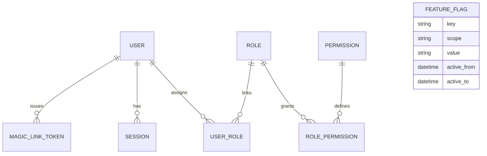
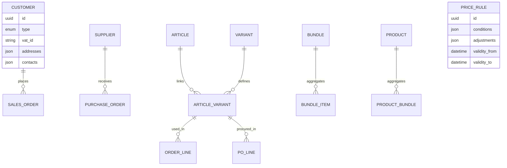
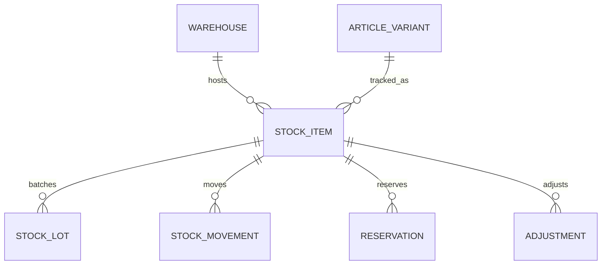
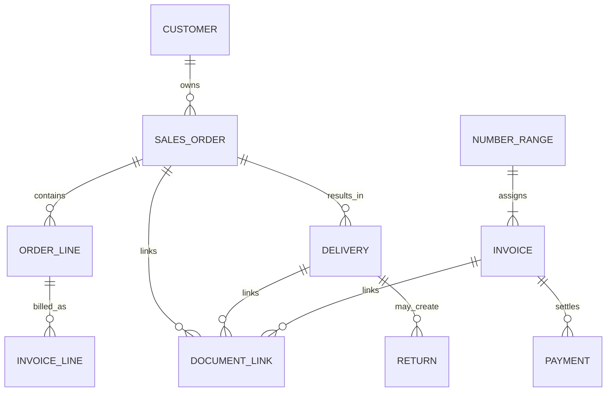
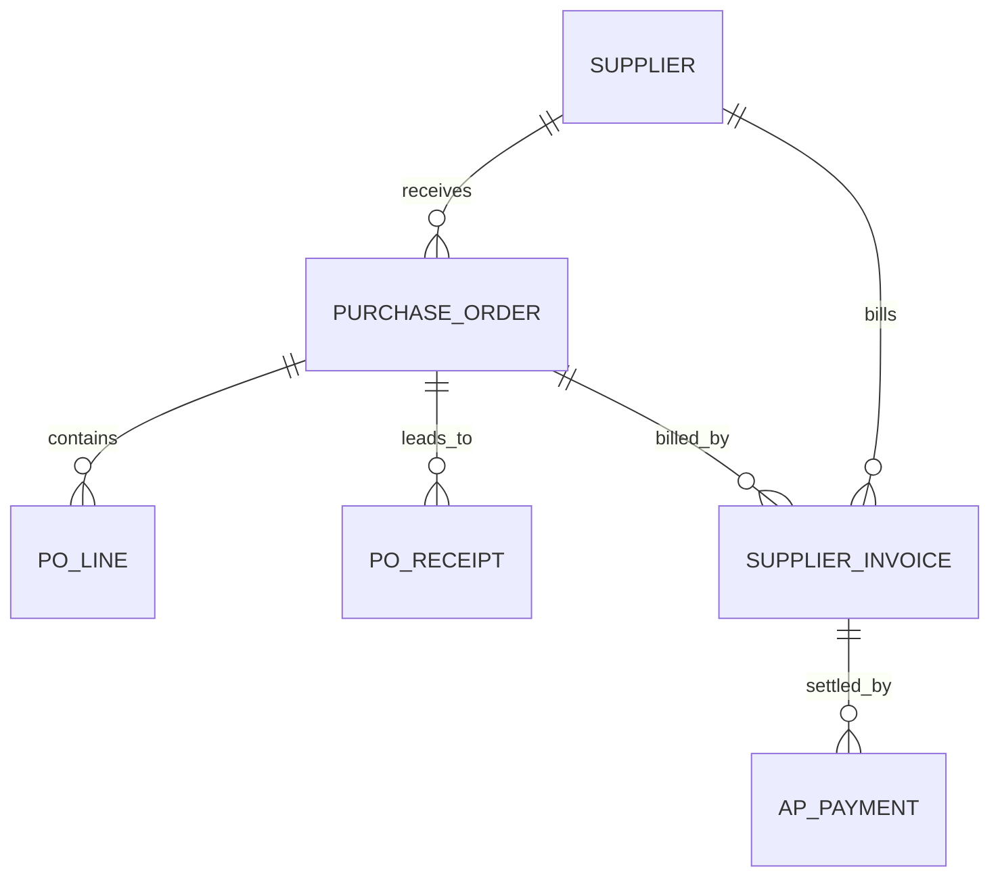
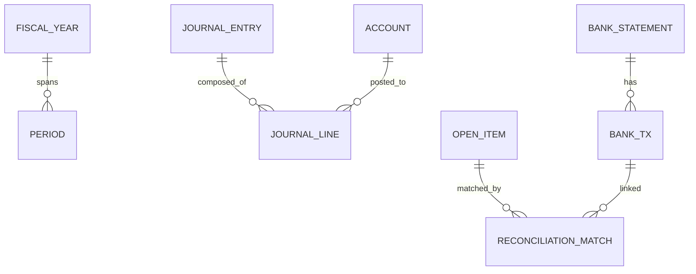
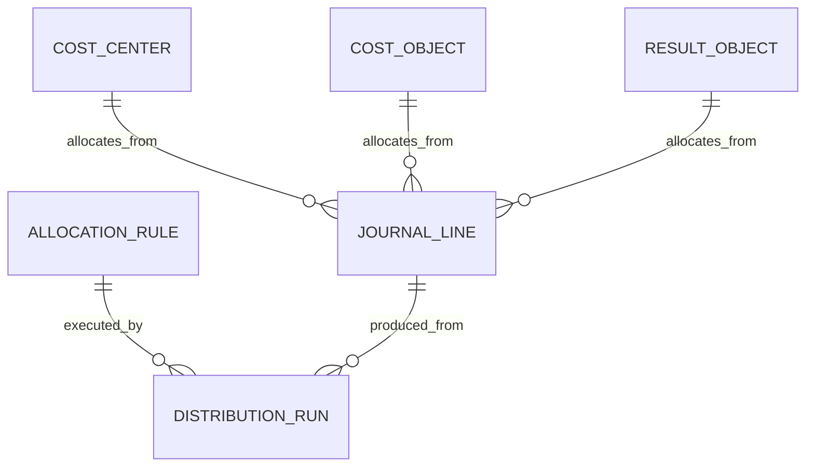
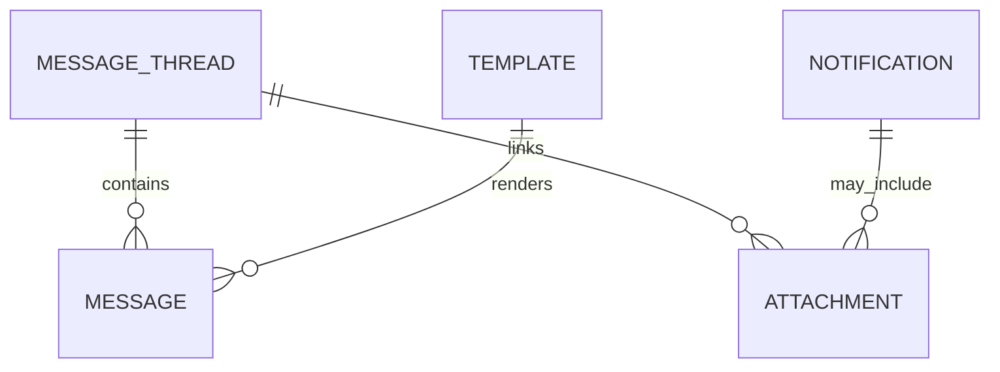

# CoreHub ERDs (Text + Mermaid Drafts)

## Identity & Access

## Master Data (Customer/Supplier/Articles)

## Inventory

## Sales & Fulfillment

## Procurement

## Finance (GL/AR/AP)

## Kost/Controlling

## Communication & Docs

> Note: All core tables carry tenant_id, created_at/by, updated_at/by; validity_from/to on mutable master data and rules.
