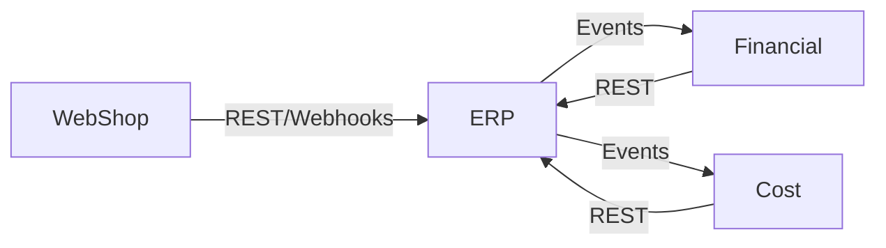
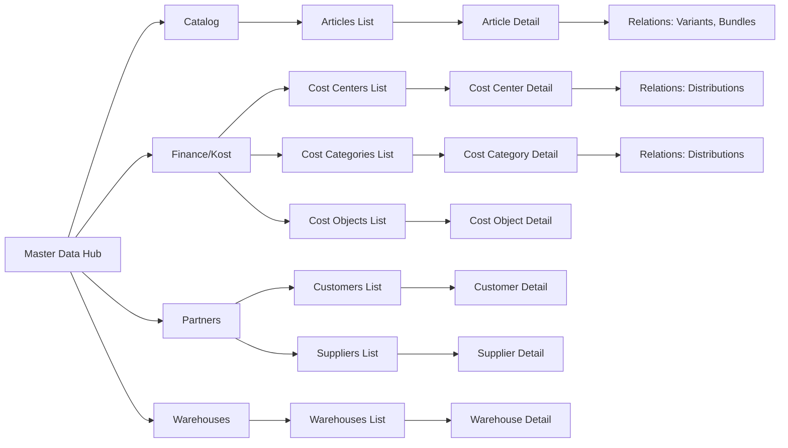

# CoreHub ERP/Finance/Kost System – Technical Concept (Draft)

## 1) Scope, Findings, and Must-Haves
- Objective: Modular ERP with connected Accounting and Kost (cost accounting) plus 1-n online shops and stakeholder self-service; automation-first, API-first, cloud-ready.
- Findings from input: Start with PHP/MariaDB web app, migrate to cloud (e.g., AWS) later; code in English; UI bilingual (DE/EN) with extensible i18n; flexible roles/permissions per function (CRUD) per x.php page; features can be toggled on/off.
- Mandatory capabilities: Magic-link login + SSO-ready; built-in email client; PDF generation; API integration; multi-DB strategy (ERP, Finance, Kost, Shop, etc.); validity checks and temporal data; automation workflows; German/EU compliance (GDPR/DSGVO, GoBD, eInvoicing, flexible tax rules); modern price finding and costing (cost centers/carriers/results); document number ranges (legal); full GL with double-entry bookkeeping from day one, plus open items and bank reconciliation; digital communication to customers/suppliers; AI integration hooks.
- Non-goals (initial): Mobile native apps, on-prem legacy DB support, custom hardware integration.

## 2) Architecture Principles
- Modular domain services (ERP, Finance, Kost, Identity, Communication, Catalog/Pricing, Workflow) with clear Bounded Contexts; API-first (REST + async events); eventual cloud decomposition into containers or serverless.
- Separation of concerns: UI (web), API gateway, service layer, data layer per domain, shared foundation (identity, audit, i18n, notifications, docs).
- Scalability: Stateless service nodes, horizontal scaling, CDN for assets, caching (Redis), message bus (Kafka/AMQP/SNS/SQS) for async workflows.
- Extensibility: Feature flags/config service, plugin points for pricing rules, tax rules, workflows, and integrations.
- Security: Principle of least privilege, token-based auth (JWT/OAuth2/OIDC), short-lived magic-link tokens, audit trails, encryption in transit/at rest, secrets management.
- Compliance-ready: Data residency options, retention + deletion policies, immutable audit logs, number-range control.

## 3) Target System Topology (future-state)
- Web/UI: PHP front (initial) with progressive migration to a SPA frontend (React/Vue) consuming APIs; server-side rendering fallback for SEO/shop.
- Distributed system with separated applications: ERP, Financial, Cost, WebShop.
- Interfaces between applications: REST/JSON for synchronous calls plus async events on a message bus (Kafka) for decoupled workflows; both work across separate hosting.

### System Interface Diagram

- API Gateway/Edge: Auth, rate limiting, request validation, versioning, feature flag injection.
- Core Services (logical):
  - Identity & Access (IAM): users, roles, permissions, magic-link issuance, session mgmt.
  - Catalog & Pricing: articles, variants, bundles, products, campaigns, price rules engine.
  - Orders & Fulfillment: quotations, orders, deliveries, returns, shipments.
  - Invoicing & Documents: invoices (incl. EU eInvoice), number ranges, PDF/e-delivery.
  - Inventory & Stock: stock levels, movements, reservations, warehouses.
  - Procurement: suppliers, purchase orders, receipts, AP matching.
  - Accounting (GL/AR/AP): chart of accounts, journal engine, double-entry postings, open items, reconciliation.
  - Kost (Controlling): cost centers, cost objects/carriers, allocations, results objects.
  - Banking: statements import, matching engine, SEPA export (future), PSD2 APIs.
  - Communication: email client, templates, omnichannel notifications; attachment store.
  - Workflow & Automation: BPMN/state-machine engine, tasks, SLA timers, RPA/AI hooks.
  - Audit & Compliance: immutable logs, retention, exports for authorities.
- Shared Components: Feature flag service, configuration service, document service (PDF, storage), localization service, search/indexing (e.g., OpenSearch), monitoring/logging stack.

## 4) Data and Database Strategy
- Poly-DB layout: separate logical databases per domain (ERP, Finance/GL, Kost, Shop) to allow scaling and compliance boundaries; support read replicas for reporting; cross-domain joins avoided in-app—use APIs/events.
- MariaDB 10 initial; design schemas with future cloud migration (Aurora/MySQL) in mind; use strict SQL modes, utf8mb4, row-based binlog.
- Multi-tenant ready (even single-tenant now): tenant_id columns and row-level filters; per-tenant encryption keys optional.
- Temporal/validity: all master data that changes over time uses validity_from/validity_to and status; store versioned records; audit_created/updated_by timestamps.
- Number ranges: dedicated table per document type with legal constraints and gap handling; support configurable prefixes/suffixes per legal entity and year.

## 5) Identity, Access, and Security
- Auth: email + password, optional magic-link; prepare for OIDC/OAuth2 for SSO; device/session binding and IP/rate limits for magic links.
- Magic-link fallback: optional 6-digit code for cases where the user has no email access on the device (out-of-band verification).
- RBAC with permissions on (resource, action) tuples; map UI actions (per x.php page) to permissions; allow role hierarchies and custom roles; feature flags guard UI and API.
- Audit: record who/when/what for data mutations; immutable append-only log for finance/GL relevant events; change history per record.
- Data protection: encryption at rest (DB + object storage), TLS everywhere, secrets manager; PII minimization and field-level masking where needed.

## 6) Localization and UX
- UI in DE/EN at launch; resource bundle approach with fallback; locale from user profile; currency/number/date formatting per locale.
- Content versions: email/PDF templates localized; legal texts per country; tax rules parameterized.
- Accessibility and responsive layout; portal for customer self-service (orders, invoices, tickets, profile, consents, magic-link access).

## 7) Workflow and Automation
- Use workflow engine (BPMN/state-machine, e.g., Temporal/Camunda) for long-running processes: order-to-cash, procure-to-pay, invoice approval, returns, bank matching.
- Rules engine for pricing/tax/discounts; allow user-defined rules with effective dates and simulation before go-live.
- Task queue for background jobs (emails, PDF generation, imports, reconciliation); retries with dead-letter queues.

## 8) Communication, Documents, and Shops
- Email: embedded IMAP/SMTP client or provider API; shared inbox per tenant; templated messages; DKIM/SPF/DMARC ready.
- PDFs: server-side rendering (e.g., wkhtmltopdf/Chromium-based) with template versioning; archive originals for audit.
- Messaging: notifications via email/SMS/push/webhooks; customer portal messaging thread.
- Shops: 1-n shops; shared catalog with per-shop pricing, availability, tax rules; connectors for popular shop APIs; webhooks for orders/returns; stock reservation via API.

## 8.1) Document Lifecycle and Numbering (Baseline)
- Lifecycle states (baseline):
  - Order: draft -> confirmed -> delivered -> invoiced -> closed; can be canceled before invoiced.
  - Delivery: draft -> shipped -> completed; can be canceled or returned.
  - Invoice: draft -> issued -> posted -> paid -> closed; corrections via credit note and re-issue, not delete.
  - Credit note: draft -> issued -> posted -> settled.
- Number assignment: only on issued documents; drafts do not consume numbers.
- Default behavior: issuing an invoice auto-posts it to GL and creates the open item; approvals can be added later if needed.
- Number ranges: per legal_entity + doc_type + fiscal_year; sequential, no reuse. Canceled/voided numbers remain consumed for audit.
- Corrections: use credit notes (storno) and replacement invoices; keep full audit trail and PDF history.
- Output: every issued document has a PDF; invoices also store XRechnung XML (and optional ZUGFeRD) alongside PDF.
- Document links: any document can reference other documents (e.g., delivery from multiple orders, invoice from multiple deliveries). Use a generic link table for traceability and audit.

## 9) Core Domain Data Model (high-level entities)
- Identity: User, Role, Permission, Session, MagicLinkToken, FeatureFlag.
- Master: Customer (B2C/B2B, contacts, addresses), Supplier, Article, Variant (reusable packaging/unit/dimension definitions with SKU/UoM), ArticleVariant (article+variant link with base price), Bundle, Product, PriceRule, Campaign, TaxRule, Warehouse, Location.
- Cost/Controlling: CostCenter, CostObject/Carrier, ResultObject, AllocationRule, DistributionRun.
- Sales: Quote, SalesOrder, OrderLine, Delivery, Return, Invoice, InvoiceLine, CreditNote, Payment, Receipt, NumberRange, InvoiceSourceLink.
- Procurement: PurchaseOrder, POReceipt, SupplierInvoice, AP Payment.
- Inventory: StockItem, StockLot, StockMovement, Reservation, Adjustment.
- Finance: Account, JournalEntry, JournalLine, FiscalYear, Period, OpenItem, BankStatement, ReconciliationMatch, LedgerDocument.
- Communication: MessageThread, Message, Attachment, Template, Notification.
- Workflow: ProcessDefinition, ProcessInstance, Task, Timer, Event.

## 10) APIs and Integration
- REST/JSON with versioned paths; future GraphQL for portals; webhooks for outbound events; idempotency keys for writes.
- Async events per domain (e.g., order.created, invoice.posted, payment.matched) on message bus for decoupling and automation triggers.
- Import/export adapters: CSV/Excel for master data; DATEV/GoBD-compliant exports; PSD2/FinTS/EBICS for banking (future); PEPPOL/XRechnung for eInvoice.

### Web Shop Ingest (Minimal)
- Auth: API key per shop (or OAuth later); idempotency-key header required.
- POST /v1/integrations/shop/orders
  - Payload: {shop_id, order_id, status, order_date, currency, customer, lines[], totals, addresses, payment, raw_payload}
- POST /v1/integrations/shop/customers
  - Payload: {shop_id, customer_id, email, name, addresses, contacts, raw_payload}
  - Usage: send on create and update to keep customer master data in sync.
- Optional webhook callbacks: /v1/integrations/shop/ack (accepted/rejected) with trace_id.

## 11) Pricing, Tax, and Costing
- Pricing service supports base price + rule stack (channel/shop, customer group, campaign, coupons, currency, quantity/tiers, dimensions/weight, attributes); simulations and future-effective rules.
- Price resolution order: article+variant base price -> apply pricing rules (discounts/surcharges) -> apply dimension/weight formulas.
- Dimensions/weight: stored in variant attributes; rules can define formulas (e.g., area or weight based) to calculate final price.
- Tax engine parameterized per country/region; flexible tax codes, reduced rates, reverse charge, OSS; effective-dated changes.
- Costing: allocations across 1-n cost centers/carriers/results with rules; automatic distributions and cost sheets; variance tracking.

## 12) Compliance and Governance
- Germany/EU: GDPR/DSGVO (consent, data subject rights, retention/deletion), GoBD (immutable logs, audit trail, procedural documentation), KassenSichV considerations for POS, eInvoicing (XRechnung/PEPPOL), VAT/TAX change readiness.
- Data retention: configurable per entity; legal holds; backups with retention; disaster recovery RPO/RTO targets.
- Reporting: standard financial statements (GuV, Bilanz), open items lists, VAT reports; export to auditors/authorities.

## 13) Operations and Housekeeping
- Observability: structured logs, metrics, traces; alerting; request IDs propagated.
- Background jobs with queues; scheduled housekeeping (cleanup expired sessions/magic links, archive old docs, reindex search, rotate logs).
- Configuration management: centralized config with history; feature flags per tenant; maintenance mode per service.
- Deployment: CI/CD pipeline, automated tests (unit/api/e2e), linting, SAST/DAST; infra as code for cloud move.

## 14) Migration Path (initial stack to cloud)
- Phase 1: PHP + MariaDB monolith with modular boundaries enforced in code; introduce message queue and background worker.
- Phase 2: Extract services (Identity, Pricing, Workflow) into containers; use API gateway; add cache and object storage for documents.
- Phase 3: Move DBs to managed services (Aurora/MySQL), use managed MQ, add search (OpenSearch), introduce autoscaling and CDN.

## 15) Decisions (agreed defaults)
- Identity provider: Keycloak (self-hosted) with magic-link flow; OIDC-ready for future SSO.
- Workflow engine: Temporal for durable, retryable workflows.
- Message bus: Kafka (experience available); use topics for domain events and worker consumption.
- Accounting scope: Full GL with double-entry bookkeeping from day one (not open-items only).
- Chart of accounts: default template SKR03; allow optional SKR04/custom templates later.
- COA seeding: initialize accounts from the chosen template during tenant setup (wizard/import), with manual edits allowed afterward.
- Shop connectors: Shopware and Shopify first; webhook-driven sync; push stock/price updates.
- Banking: Start with CSV/MT940 import + semi-automatic matching; plan PSD2/FinTS next.
- PDF renderer: HTML-to-PDF via headless Chromium (wkhtmltopdf fallback) with versioned templates.
- AI scope (initial): Document classification/routing; bank match suggestions; portal chat assist.

## 16) Open Points / Decisions Needed
- Hosting baseline security requirements (network segregation, WAF, DDoS protection) and target RPO/RTO.
- Message bus ops profile: partitioning/retention/SLA per domain topic; DR strategy.
- AI data boundaries (PII handling), model hosting choice, and human-in-the-loop controls.
- Shop connectors: prioritize secondary set (e.g., Magento) and decide sync cadence (push vs. scheduled pull) per channel.
- Banking: PSD2/FinTS provider choice and timing; EBICS need and timeline.
- Workflow authoring UX: developer-defined only vs. limited business-configurable steps.
- PDF template governance: who owns templates, approval flow, and localization policy.
 - Payments: PSP integration path (PayPal first) deferred for now; revisit when payment scope starts; webhook handling and reconciliation to be defined then.

## 31) PayPal Integration Plan (Draft)
- Flow: create PayPal order -> redirect/approve -> capture -> webhook (PAYMENT.CAPTURE.COMPLETED) -> reconcile to invoice/open item.
- API client: server-side create/capture with idempotency keys; store PayPal order_id and capture_id on payment record.
- Webhooks: validate signature, verify event via PayPal API, idempotent processing keyed by event id; enqueue to Kafka (payment.captured, payment.failed).
- Reconciliation: on capture success, create payment entry, match to open item; on partial capture, keep residual open item; on refund, create credit note and reverse posting.
- Error handling: retries with backoff; DLQ for failed webhook processing; alert on repeated signature failures.
- Security: store client secrets in secrets manager; use TLS, IP allowlist optional; log minimal PII.

## 17) Proposed Starting Plan
- Lock remaining open points (above) and finalize PoC defaults.
- Model initial schema boundaries (ERP, Finance, Kost) with temporal columns and number-range tables; implement RBAC + feature flags + audit.
- Stand up communication service (email + PDF templates) and basic portal with magic-link flow.
- Implement pricing/tax rule engine (MVP) and cost allocation rules; seed master data for customers, suppliers, articles, variants.
- Build order-to-cash happy path: order -> delivery -> invoice -> posting -> payment matching.
- Add bank statement import + reconciliation matching; generate GoBD-compliant audit logs.
- Prepare CI/CD, observability, and housekeeping jobs from day one.

## 18) Detailed Data Model (initial cut)
- Identity/IAM: user(id, email, password_hash, status, locale, tenant_id, created_at/by, updated_at/by); role(id, name, tenant_id); permission(id, resource, action); user_role(user_id, role_id); role_permission(role_id, permission_id); magic_link_token(id, user_id, token, expires_at, used_at, ip_hint, device_hint); session(id, user_id, issued_at, expires_at, revoked_at, ip, ua); feature_flag(id, key, scope, value, active_from/to).
- Master Data: customer(id, type B2C/B2B, legal_entity, vat_id, addresses json, contacts json, status, tenant_id, validity_from/to); supplier(id, legal_entity, vat_id, addresses, contacts, status, tenant_id, validity_from/to); article(id, name, status, tenant_id, validity_from/to); variant(id, sku, name, attrs json, uom, status, tenant_id, validity_from/to); article_variant(id, article_id, variant_id, base_price, status, validity_from/to); bundle(id, name, status); bundle_item(bundle_id, article_id, qty); product(id, name, status); product_bundle(product_id, bundle_id, qty); tax_rule(id, country, region, rate, type, reverse_charge flag, validity_from/to); warehouse(id, name, location, status); price_rule(id, scope shop/customer_group/channel, currency, conditions json, adjustments json, validity_from/to).
- Inventory: stock_item(id, article_variant_id, warehouse_id); stock_lot(id, stock_item_id, lot_no, expiry_date); stock_movement(id, stock_item_id, qty, direction, ref_type, ref_id, cost, occurred_at); reservation(id, stock_item_id, order_line_id, qty, expires_at); adjustment(id, stock_item_id, qty, reason, occurred_at).
- Sales/Orders: sales_order(id, customer_id, status, order_date, currency, totals json, tenant_id, validity_from/to); order_line(id, sales_order_id, article_variant_id, qty, price, tax_code, cost_center_id, cost_object_id, result_object_id); delivery(id, sales_order_id, status, ship_date, tracking_no); return(id, sales_order_id, status, reason, qty json); invoice(id, invoice_no, status, doc_date, due_date, currency, totals json, number_range_id, legal_entity_id, pdf_uri); document_link(id, source_type, source_id, target_type, target_id); invoice_line(id, invoice_id, order_line_id, qty, price, tax_code); credit_note(id, invoice_id, status, totals json); payment(id, invoice_id, amount, method, received_at, open_item_id);
- Procurement: purchase_order(id, supplier_id, status, order_date, currency, totals json); po_line(id, purchase_order_id, article_variant_id, qty, price, tax_code); po_receipt(id, purchase_order_id, status, received_at); supplier_invoice(id, supplier_id, purchase_order_id, invoice_no, status, totals json, open_item_id); ap_payment(id, supplier_invoice_id, amount, paid_at).
- Finance/GL: account(id, code, name, type asset/liability/equity/income/expense, tax_code, status); fiscal_year(id, start_date, end_date, status); period(id, fiscal_year_id, seq, start_date, end_date, status); journal_entry(id, doc_type, doc_id, date, status, legal_entity_id, tenant_id); journal_line(id, journal_entry_id, account_id, debit, credit, cost_center_id, cost_object_id, result_object_id); open_item(id, party_type customer/supplier, party_id, doc_type, doc_id, amount, currency, due_date, status); bank_statement(id, account_ref, period_id, imported_at, source_type csv/mt940); bank_tx(id, bank_statement_id, amount, currency, value_date, counterparty, ref_text, match_status, open_item_id); reconciliation_match(id, bank_tx_id, open_item_id, confidence, decided_by, decided_at);
- Kost/Controlling: cost_center(id, code, name, status, validity_from/to); cost_category(id, code, name, status); cost_center_distribution(id, cost_center_id, cost_category_id, share, validity_from/to); cost_object(id, code, name, status, validity_from/to); cost_category_distribution(id, cost_category_id, cost_object_id, share, validity_from/to); result_object(id, code, name, status, validity_from/to); allocation_rule(id, source_type account/cost_center, target_type cost_center/cost_object/result_object, driver_type qty/value, formula json, validity_from/to); distribution_run(id, rule_id, period_id, executed_at, status, result json). Rules: shares per distribution set must sum to 1.0 per validity window; manual splits on journal lines override default distributions and do not apply the shares again.
- Communication/Docs: message_thread(id, type order/invoice/ticket/customer, ref_id, customer_id, status); message(id, thread_id, sender_type system/user/customer, body, direction in/out, sent_at); template(id, type email/pdf, locale, version, body, status); attachment(id, uri, content_type, checksum, linked_type invoice/order/etc, linked_id); notification(id, user_id, channel email/sms/webhook, payload json, sent_at, status).
- Audit/Validity: All mutable tables carry created_at/by, updated_at/by, status, validity_from/to where business meaning requires temporal tracking; finance tables also emit immutable ledger events.

## 19) Service Interfaces (initial)
- REST (versioned):
  - IAM: POST /v1/auth/login, POST /v1/auth/magic-link, POST /v1/auth/verify, GET /v1/users, POST /v1/users, POST /v1/roles, POST /v1/feature-flags/:key/toggle.
  - Catalog/Pricing: GET/POST articles, variants, bundles, products; POST /pricing/simulate; POST /tax/validate.
  - Orders: CRUD sales orders, deliveries, returns; POST /orders/:id/confirm; POST /orders/:id/deliver; POST /orders/:id/invoice.
  - Invoicing/Docs: GET/POST invoices, credit notes; POST /invoices/:id/issue (auto-posts to GL by default); POST /invoices/:id/pdf; GET /number-ranges.
  - Inventory: GET/POST stock movements; POST /reservations; POST /adjustments.
  - Procurement: CRUD purchase orders, receipts; POST /purchase-orders/:id/receive; POST /supplier-invoices; POST /supplier-invoices/:id/post.
  - Finance/GL: POST /journal-entries; GET /accounts; GET /open-items; POST /reconciliation/match.
  - Banking: POST /bank-statements/import (csv/mt940); GET /bank-tx; POST /bank-tx/:id/match.
  - Communication: POST /messages; POST /notifications; POST /templates.
- Kafka topics (examples): identity.user.created; catalog.article.changed; pricing.rule.changed; order.created; order.confirmed; delivery.created; invoice.posted; payment.captured; bank.statement.imported; bank.tx.matched; gl.journal.posted; cost.allocation.run; notification.sent.
- API design notes: idempotency keys on POST that create side effects; pagination and filtering; ETag/If-Match for concurrency on key resources; error model with trace id.

## 20) Initial Workflows (Temporal)
- Order-to-Cash: order.created -> reserve stock -> confirm -> delivery -> invoice -> auto-post to GL -> generate PDF -> send to customer -> await payment -> reconcile -> close open item; compensations for failed steps (release reservation, cancel invoice draft).
- Procure-to-Pay: PO created -> approval (optional) -> send to supplier -> receive goods -> 3-way match (PO/receipt/invoice) -> auto-post AP on invoice -> schedule payment -> mark open item paid.
- Bank Reconciliation: ingest statement -> auto-match candidates (rules + AI suggestions) -> human review queue for low-confidence -> post matches -> update open items.
- Pricing/Tax Update: create rule with validity_from -> simulate impact -> approve -> activate via feature flag/config service -> emit pricing.rule.changed.
- Magic-Link Auth: request link -> generate short-lived token -> email dispatch -> token verify -> create session -> optional device binding and IP/rate checks.

## 20.1) Phased Rollout and Posting Controls
- Phase 1 (documents only): orders, deliveries, invoices can be issued and stored without GL/Kost posting; documents remain in a posted-ready state.
- Phase 2 (FiBu/Kost live): enable posting for new documents and allow controlled back-posting for existing documents.
- Back-posting rules: posting uses the data snapshot stored on the document at issue time (lines, totals, taxes) to avoid silent changes; any adjustments require an explicit correction document.
- Pre-booking review UI: provide a dedicated review screen for invoices/supplier invoices to check and adjust cost center/cost object allocations before posting.
- Adjustment interface: allow optional manual splits and overrides during review; once posted, changes require reversal and re-posting for audit safety.
- Integration swap: keep posting behind a service interface so the GL/Kost backend can be replaced later without changing document flows.

## 21) Next Detailing Steps
- Expand table definitions with keys/indexes, constraints, and validity/audit columns; draft ERD per domain.
- Define Kafka topic conventions (naming, key/partitioning, schema with JSON/Avro), retention, and DLQ policy.
- Specify API schemas (OpenAPI) for main flows (orders, invoices, payments, reconciliation) and idempotency rules.
- Define PDF/email template data contracts per document type; versioning and localization strategy.
- Outline access control matrix mapping UI pages (x.php) to permissions and feature flags.
- Write workflow definitions (Temporal) for order-to-cash and bank reconciliation with retry/backoff policies.

## 30) Artifacts (Current Drafts)
- ERDs: see .Concept/ERDs.md
- Table specs: see .Concept/DataModel-Tables.md
- OpenAPI outline: see .Concept/OpenAPI-Stubs.md and .Concept/OpenAPI-Full.yaml
- Temporal workflows: see .Concept/Workflows-Temporal.md
- Kafka schemas/policies: see .Concept/Kafka-Schemas-and-Policies.md
- PayPal integration flow: see .Concept/PayPal-Integration.md

## 32) UX & Mobile Focus (Reminder)
- Responsive-first layouts; ensure all core flows usable on mobile (self-service portal, order status, invoice download, payments).
- Fast paths: magic-link login frictionless on mobile; minimal form steps; inline validation; accessible components.
- Performance: cache/catalog reads; CDNs for assets/PDFs; async loads for heavy data tables with pagination.
- PWA-friendly: add manifest/offline-lite for portal; push notifications optional.
- Internationalization: DE/EN at launch; RTL-ready later.

## 33) Admin UX – Master Data Maintenance (Standard Pattern)
- Use a standard CRUD schema across all master data lists (tables): list -> detail -> create/update/delete.
- Provide a common "relations" panel on each detail view to link/unlink related objects (e.g., cost centers -> distributions, articles -> variants).
- Inline editors for relationship tables (add/remove rows, edit share/validity) with immediate validation (e.g., share sum = 1.0 per period).
- Bulk actions on lists (multi-select, assign category, bulk import/export CSV) to reduce repetitive work.
- Consistent list filters/search, sort, pagination; show last updated and status at a glance.
- Navigation consistency: define a single navigation registry (config) with labels, routes, permissions, and feature flags; top bar, left nav, and quick links render from the same source.
- Dashboard tiles use a similar registry (tile id, data source, permissions) to avoid duplicating links and ensure consistent visibility.

### Screen Map (One-Page)

## 22) ERD Notes (indices/constraints, per domain)
- IAM: user(email unique, tenant_id idx); role(name+tenant unique); permission(resource+action unique); junction tables FK+PK (user_id, role_id), (role_id, permission_id); magic_link_token(token unique, expires_at idx, user_id FK); session(user_id FK, expires_at idx); feature_flag(key unique per tenant/scope).
- Master: customer(vat_id idx, type idx, validity range); supplier(vat_id idx); article(name idx, status idx); variant(sku unique, name idx, uom idx, attrs as JSON with GIN in future if moved); article_variant(article_id FK idx, variant_id FK idx); bundle/product junctions with PK(bundle_id, article_id) / PK(product_id, bundle_id); tax_rule(country, region, validity range idx); price_rule(scope fields idx, validity range idx).
- Inventory: stock_item(article_variant_id, warehouse_id unique); stock_movement(stock_item_id idx, occurred_at idx); reservation(stock_item_id idx, order_line_id unique, expires_at idx); adjustment(stock_item_id idx).
- Sales: sales_order(customer_id idx, status idx, order_date idx); order_line(sales_order_id idx, article_variant_id idx); delivery(sales_order_id idx, ship_date idx); invoice(invoice_no unique per legal_entity/year, due_date idx); document_link(source_type+source_id idx, target_type+target_id idx); invoice_line(invoice_id idx); payment(invoice_id idx).
- Procurement: purchase_order(supplier_id idx, status idx); po_line(purchase_order_id idx); supplier_invoice(supplier_id idx, invoice_no per supplier unique, status idx); ap_payment(supplier_invoice_id idx).
- Finance: account(code unique, type idx); fiscal_year(unique per legal entity), period(fiscal_year_id idx, seq unique per FY); journal_entry(doc_type+doc_id unique, date idx); journal_line(journal_entry_id idx, account_id idx, cost refs idx); open_item(party_type+party_id idx, due_date idx, status idx); bank_statement(period_id idx); bank_tx(bank_statement_id idx, value_date idx, match_status idx); reconciliation_match(bank_tx_id unique).
- Kost: cost_center/code unique, validity range; cost_category/code unique; cost_center_distribution(cost_center_id idx, cost_category_id idx); cost_object/code unique; cost_category_distribution(cost_category_id idx, cost_object_id idx); result_object/code unique; allocation_rule(validity range idx); distribution_run(rule_id idx, period_id idx).
- Communication/Docs: message_thread(ref_type+ref_id idx); message(thread_id idx, sent_at idx); template(type+locale+version unique); attachment(linked_type+linked_id idx); notification(user_id idx, sent_at idx, status idx).

## 23) Kafka Conventions
- Topic naming: domain.event_name (e.g., order.created, invoice.posted, bank.tx.imported, gl.journal.posted, pricing.rule.changed).
- Keys: entity id (e.g., order_id) to ensure ordering per aggregate; for bank.tx, use bank_tx_id; for pricing.rule.changed, use rule_id.
- Partitions: start with 6-12 per active domain; increase with throughput; maintain ordering per key.
- Value schema: JSON initially; plan Avro/Schema Registry for compatibility; include event_id (UUID), event_type, occurred_at (ISO8601), producer, trace_id, payload, version.
- Headers: trace_id, tenant_id, schema_version; idempotency handled by consumers via event_id dedupe store.
- Retention: business events 7-14 days + compacted topic per aggregate for current state; DLQ per domain with 14-30 days retention; consumer groups per service.

## 24) API (OpenAPI) Draft Coverage
- Auth/IAM: login, magic-link request/verify, user CRUD, role/permission CRUD, feature-flag toggle.
- Catalog/Pricing: article/variant/bundle/product CRUD; pricing simulate; tax validate.
- Orders/Fulfillment: order CRUD, confirm, deliver, return; delivery creation; reservation endpoints.
- Invoicing/Documents: invoice/credit-note CRUD; generate PDF; post to GL; number-range query.
- Inventory: stock movements, reservations, adjustments.
- Procurement: PO CRUD, receive, supplier invoice, post AP.
- Finance: journal entry post, accounts list, open items list, reconciliation match.
- Banking: bank statement import (csv/mt940), tx list, match; future PSD2/FinTS placeholder.
- Communication: send message/notification, manage templates.
- Conventions: idempotency-key header for POST that create side effects; pagination (limit, cursor); filtering; error object with trace_id; ETag/If-Match for updates on critical resources.

## 25) Access Control Matrix (excerpt)
- /auth/*: public (login, magic-link request); verify requires token; sessions tied to user.
- /users, /roles, /permissions: requires permission iam.manage.*
- /feature-flags: requires permission config.manage.flags
- /articles, /variants, /pricing: catalog.manage or catalog.view accordingly.
- /orders: order.view/order.manage; transitions (confirm/deliver/invoice) require order.transition.
- /invoices: invoice.view/invoice.manage; posting requires finance.posting.
- /journal-entries, /open-items, /reconciliation: finance.manage or finance.view; reconciliation match requires finance.reconcile.
- /bank-statements import: finance.bank.import; matching: finance.reconcile.
- /templates, /notifications: comms.manage.
- Feature flags also gate beta/expensive flows; permissions checked at controller + service layer; audit log on mutating endpoints.
- All admin screens must enforce these permissions consistently in both UI and backend, including shared administration across users/groups.

## 26) Workflow Specs (Temporal) – More Detail
- Order-to-Cash: activities for reserve stock, confirm order, create delivery, capture shipment, create invoice, post GL, render PDF, send email, await payment (timer), reconcile payment; compensations: release reservation, void invoice draft, cancel delivery.
- Procure-to-Pay: activities for PO approval (optional), send to supplier (email/API), receive, 3-way match, post AP, schedule payment; compensations: receipt reversal, AP reversal before payment.
- Bank Reconciliation: import statement, parse lines, candidate matching (rules+AI), human task queue for low confidence, post matches, emit events; timers for SLA reminders.
- Pricing/Tax Update: draft rule, simulate, approval gate, activate (flag/config), emit events; rollback via previous version reactivation.
- Magic-Link Auth: generate token, email send, verify token or 6-digit fallback code, create session, optional device binding; rate limit per IP/email.
- Reliability: retries with backoff; idempotent activities; heartbeats for long I/O; saga compensation patterns.

## 27) PDF/Email Template Contracts (initial)
- Invoice template data: legal_entity, customer (name, address, vat_id), invoice_no, doc_date, due_date, currency, lines (sku, desc, qty, price, tax_code, tax_rate, totals), totals (net, tax, gross), payment terms, bank details, QR/bank info, number_range_id, signatures/footers per locale.
- Delivery note: customer, delivery_no, order_ref, ship_date, items (sku, desc, qty, lot/serial optional), warehouse, carrier, tracking.
- Order confirmation: customer, order_no, expected_ship, items, prices, tax summary.
- Email templates: localized subject/body; placeholders for names, links (magic link), invoice/download URLs; versioned per locale and document type.

## 28) Data Protection and Validity Handling
- Temporal columns: validity_from/to on all mutable master data and tax/pricing rules; status (active/inactive/deprecated).
- Audit: created_at/by, updated_at/by on all tables; finance events also into immutable audit log.
- Soft delete avoided for finance; use status and validity ranges; hard delete only where legally permitted; tombstones via events.
- PII minimization: separate contact tables/JSON; field-level masking for sensitive data in logs/search; encryption at rest + TLS.

## 29) Housekeeping Jobs (examples)
- Expire magic-link tokens/sessions; purge old feature flag variants.
- Archive PDFs and messages older than policy; reindex search; compact Kafka with cleanup; DLQ reprocess with backoff.
- Validate number-range gaps and alert; check validity windows for expiring tax/pricing rules; stale reservations release.
- Backup verification and DR drill reminders; rotate logs and secrets.

## 30) Audit, Evidence, and Tamper Protection
- Immutable audit log service: append-only store for finance-relevant and security events (create/update/delete on master data, postings, reconciliations, permission changes, config/feature toggles). No edits/deletes; corrections via compensating events.
- Hash-chaining: per-tenant hash chain over audit records; periodic anchor snapshot (e.g., daily) stored separately to detect tampering.
- Event signing: sign critical events (GL postings, number-range consumption, invoice issuance) with service key; store signature and public key ref.
- Scope: capture who/when/what/before-after on mutable entities; include trace_id, source IP/UA for auth events; include request idempotency key on writes.
- Access logging: read-access logs for sensitive data (PII, finance, tax); configurable sampling for low-risk reads to balance volume.
- Storage: WORM-capable option for GoBD alignment; retention per legal requirements; export capability (CSV/JSON) with integrity hashes.
- Alerting: notify on privileged changes (role/permission edits, feature flag changes affecting finance, config changes to tax/pricing rules), and on audit verification failures (hash mismatch, signature invalid).
